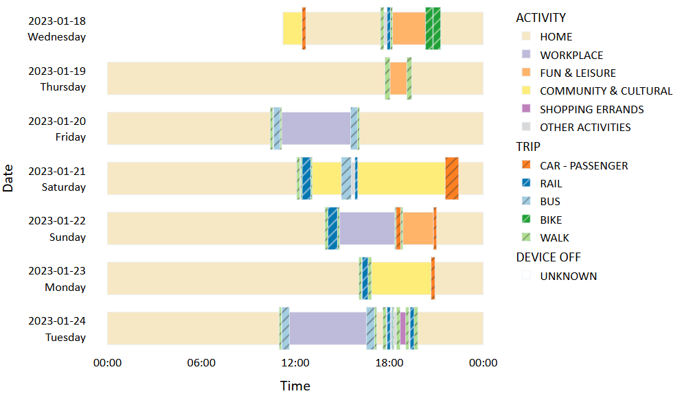

# travel_diary_explorer
A Python prototype for analyzing and visualizing travel diary data. This work is supervised by Prof. [Yingling Fan](https://www.hhh.umn.edu/directory/yingling-fan) and [Ying Song](https://cla.umn.edu/about/directory/profile/yingsong). And it is funded by the research project: [Improving Transportation Equity for all by Centering the Needs of Marginalized and Underserved Communities](https://www.cts.umn.edu/research/project/improving-transportation-equity-for-all-by-centering-the-needs-of-marginalized-and-underserved-communities).

Below are selected examples of analyses and visualizations that this repository can generate: 

1. **Individual Schedule Plot by Activity and Trip Type**. This plot  provides a clear visualization of survey participants' time allocation by activity and trip type during the study period.

2. **Statistics Table**. A summary table highlighting common attributes that describe travel behavior patterns, such as the number of trips/activities per day, daily travel distance, activity space range, and more.

3. **Travel Distance Plot by Transportation Mode and Day Type**. A visualization of travel distances segmented by transportation mode and day type. 

